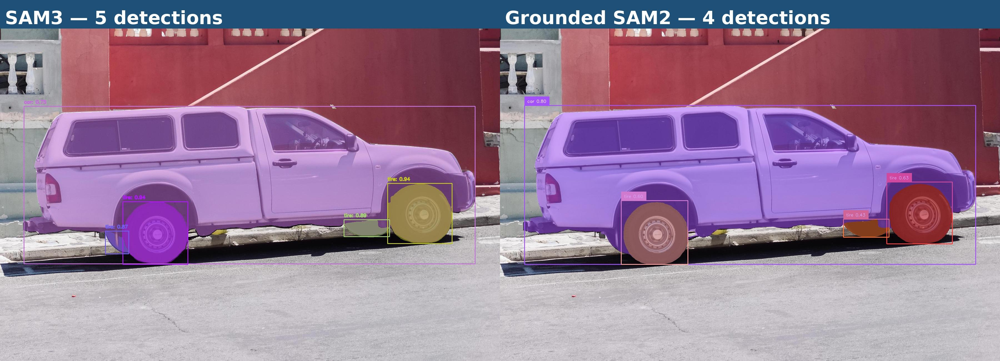

# SAM3 vs Grounded SAM 2

Side-by-side comparison of [SAM3](https://github.com/facebookresearch/sam3) (Meta) and [Grounded SAM 2](https://github.com/IDEA-Research/Grounded-SAM-2) (IDEA-Research) running in fully isolated Python environments.



---

## Quick start

```bash
git clone <repo> sam3_vs_gs2
cd sam3_vs_gs2
CUDA_HOME=/usr/local/cuda-12.8 ./scripts/setup.sh   # ~1-2 min (builds CUDA extensions)
./scripts/run_all.sh data/images/truck.jpg "car. tire."
```

---

## Checkpoints

All weights are gitignored. Download them once after cloning.

### SAM3 (Meta)

SAM3 loads weights from HuggingFace. The simplest approach is to copy an existing `huggingface_cache` into `sam3_ws/`:

```
sam3_ws/huggingface_cache/hub/models--facebook--sam3/snapshots/<hash>/sam3.pt
```

Alternatively, leave `sam3_ws/huggingface_cache/` absent — SAM3 will auto-download on first run (requires internet).

### SAM 2.1 (for Grounded SAM 2)

```bash
cd gs2_ws/source/checkpoints
bash download_ckpts.sh   # downloads all four SAM 2.1 variants
cd ../../..
```

Only `sam2.1_hiera_large.pt` is needed for the default config. The others can be deleted.

### GroundingDINO

```bash
cd gs2_ws/gdino_checkpoints
bash download_ckpts.sh   # downloads swint_ogc + swinb_cogcoor
cd ../..
```

Only `groundingdino_swint_ogc.pth` is used by default.

---

## Run a comparison

```bash
# From repo root — IMAGE can be relative or absolute
./scripts/run_all.sh data/images/truck.jpg "car. tire."
./scripts/run_all.sh ~/path/to/image.jpg "battery." my_run_name
```

Override `CUDA_HOME` if your CUDA is not at `/usr/local/cuda-12.8`:

```bash
CUDA_HOME=/usr/local/cuda-12.1 ./scripts/run_all.sh data/images/truck.jpg "car. tire."
```

---

## Output structure

```
runs/<run_name>/
├── inputs/<image_file>
├── sam3/
│   ├── <stem>_sam3_annotated.jpg
│   ├── <stem>_sam3_mask.png
│   └── <stem>_sam3_result.json
├── grounded_sam2/
│   ├── <stem>_gs2_annotated.jpg
│   ├── <stem>_gs2_mask.png
│   └── <stem>_gs2_result.json
├── comparison/
│   ├── <stem>_side_by_side.jpg
│   ├── summary.csv
│   └── notes.md
└── logs/
    ├── sam3.log
    └── grounded_sam2.log
```

---

## Repo layout

```
sam3_vs_gs2/
├── scripts/          # run_all.sh, run_sam3.sh, run_gs2.sh, setup.sh, infer scripts
├── data/images/      # shared test inputs
├── docs/             # static assets (README images)
├── runs/             # gitignored — regenerate with run_all.sh
├── sam3_ws/          # SAM3 uv workspace (wrapper + huggingface_cache + sam3 source)
└── gs2_ws/           # Grounded SAM 2 uv workspace (wrapper + checkpoints + source)
```

See [AGENTS.md](AGENTS.md) for the full operational guide.
