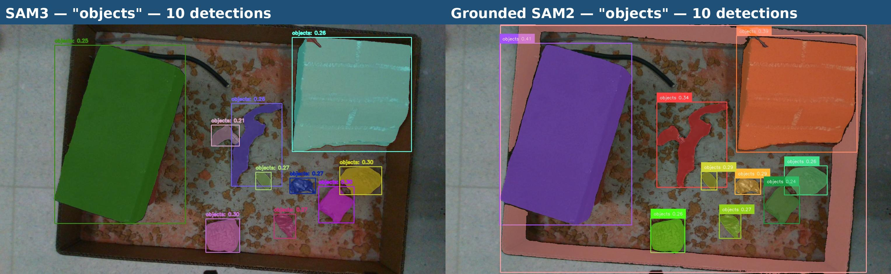
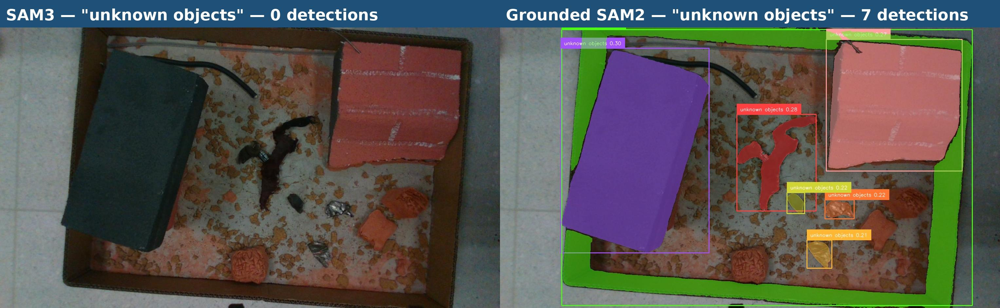

# SAM3 vs GS2 — Prompt Sensitivity

## Observation

When prompting with `"unknown objects"`, SAM3 returns 0 detections while GS2 returns 7.
With `"objects"`, SAM3 returns 10 and GS2 returns 10.

Commands run:
```bash
SAM3_CONF_THRESH=0.2 GS2_BOX_THRESH=0.2 GS2_TEXT_THRESH=0.2 \
  ./scripts/run_all.sh data/images/htx.png "objects"

SAM3_CONF_THRESH=0.2 GS2_BOX_THRESH=0.2 GS2_TEXT_THRESH=0.2 \
  ./scripts/run_all.sh data/images/htx.png "unknown objects"
```

### Prompt: `"objects"` — SAM3: 10, GS2: 10



### Prompt: `"unknown objects"` — SAM3: 0, GS2: 7



## Root Cause

### SAM3 — presence token is a multiplicative gate

In `Sam3Processor._forward_grounding`:

```python
out_probs = out_logits.sigmoid()
presence_score = outputs["presence_logit_dec"].sigmoid().unsqueeze(1)
out_probs = (out_probs * presence_score).squeeze(-1)  # scalar gate on all detections
keep = out_probs > self.confidence_threshold
```

`presence_logit_dec` is a single scalar per prompt that asks: *"is this concept present
in the image at all?"* It multiplies every detection score. If it's near zero, all
detections are wiped out regardless of individual box/mask quality.

SAM3 was trained on 4M+ known, named concepts. `"unknown"` is out-of-distribution — the
presence token can't match it to any visual concept, scores near zero, and everything
gets filtered. `"objects"` is a known high-frequency concept so the gate stays open.

### GS2 — no presence gate

GroundingDINO uses bidirectional cross-attention between text tokens and image patch
tokens. There is no single scalar bottleneck. The word `"objects"` in `"unknown objects"`
directly attends to object-like visual regions; `"unknown"` contributes little and is
effectively ignored. Works regardless of prompt phrasing.

## Summary

| Prompt | SAM3 | GS2 |
|---|---|---|
| `"objects"` | ✅ 10 detections | ✅ 10 detections |
| `"unknown objects"` | ❌ 0 detections (presence gate collapses) | ✅ 7 detections |

## Implication

- **SAM3**: Best for precise, known, named concepts. Degrades on vague/OOD language.
- **GS2**: More robust to fuzzy or catch-all prompts (`"unknown objects"`, `"things"`, etc.).

For use cases where the prompt vocabulary is uncertain or open-ended, prefer GS2.
